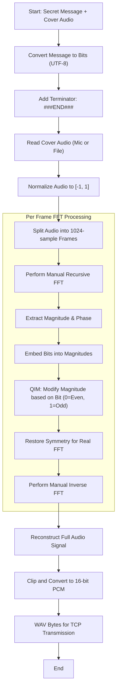
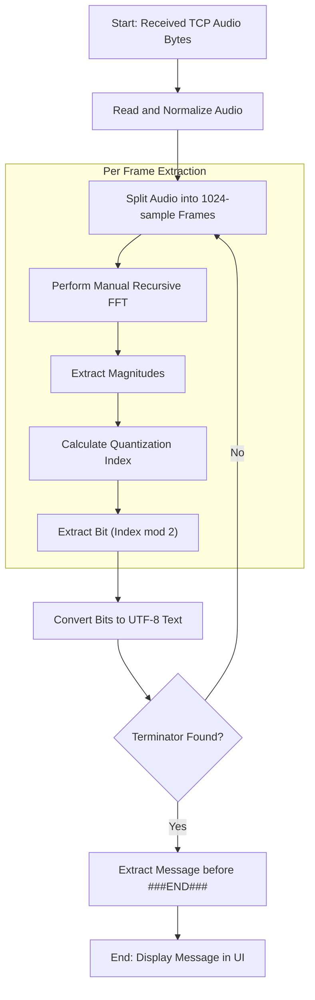

# Audio Steganography Flowchart

This project implements **Frequency-Domain Audio Steganography** using a **Manual Cooley-Tukey Fast Fourier Transform (FFT)** and **Quantization Index Modulation (QIM)**. Below are the flowcharts for the embedding and extraction processes.

## 1. Embedding Process (Hiding Data)

The embedding process converts the secret text into bits and modifies the magnitudes of specific frequency bins in the audio signal.

### Text Version: Embedding Step-by-Step
1. **Preparation**: Convert text message to bits using **UTF-8 encoding** and append the terminator `###END###`.
2. **Read Audio**: Capture audio via **Manual Start/Stop Recording** or load a `.wav` file, convert to mono, and normalize values.
3. **Framing**: Break the audio into small blocks (frames) of 1024 samples.
4. **Transform**: For each frame, perform a **Manual Recursive FFT** (Cooley-Tukey radix-2) to move to the frequency domain.
5. **Separate Components**: Get the **Magnitude** (energy) and **Phase** (timing) of each frequency.
6. **Hide Data (QIM)**: 
   - Pick frequency bins between 100Hz and 300Hz.
   - If the bit to hide is **0**, adjust the magnitude so its quantized index is **even**.
   - If the bit to hide is **1**, adjust the magnitude so its quantized index is **odd**.
7. **Symmetry**: Mirror the changes to the negative frequency spectrum to maintain signal reality.
8. **Inversion**: Use the modified Magnitudes and original Phases to perform a **Manual Inverse FFT (IFFT)**.
9. **Finalize**: Reassemble the frames, clip values, convert to 16-bit integer audio, and send over the local network via TCP.

---

## 2. Extraction Process (Retrieving Data)

The extraction process reads the incoming audio bytes, analyzes the frequency magnitudes, and reconstructs the original message.

### Text Version: Extraction Step-by-Step
1. **Receive Audio**: The `ReceiverServer` detects incoming TCP data and converts the WAV bytes back into a signal.
2. **Framing**: Break the audio into 1024-sample frames.
3. **Transform**: For each frame, perform a **Manual Recursive FFT**.
4. **Analyze Magnitudes**: 
   - Look at the frequency bins (100Hz - 300Hz).
   - Divide the magnitude by the `step` value (0.1) to find the quantization index.
   - If the index is **Even**, the bit is **0**. If the index is **Odd**, the bit is **1**.
5. **Reconstruct Message**: Group the bits into bytes and decode using **UTF-8**.
6. **Detection**: The process continues frame-by-frame until the `###END###` terminator is detected.
7. **Result**: Display the hidden message in the responsive UI.

## Technical Details

- **Manual FFT**: Implements a Cooley-Tukey radix-2 Decimation-In-Time algorithm from scratch.
- **Recording**: Uses `sounddevice` with a manual Start/Stop streaming model for flexible message lengths.
- **Responsive UI**: Uses dynamic font scaling to ensure the interface looks premium on any screen size.
- **Algorithm**: Quantization Index Modulation (QIM) in the frequency domain.
- **Frequency Range**: 100 - 300 Hz bins (Mid-frequencies).
- **Frame Size**: 1024 samples.
- **Network**: Length-prefixed TCP protocol for reliable LAN transfer.
