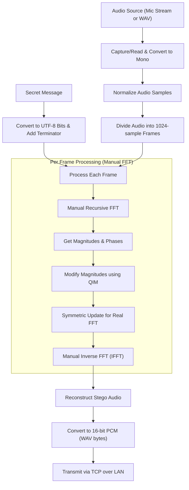
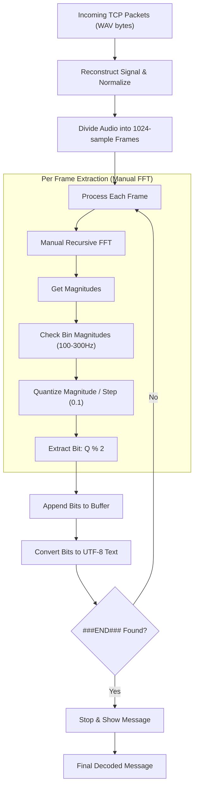
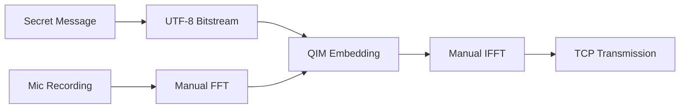
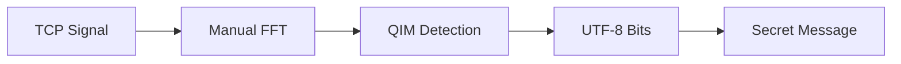

# Audio Steganography: Core Processes

This document provides a visual representation of how the FFT-based audio steganography system embeds and extracts messages using a **manual recursive FFT** algorithm.

## 1. Embedding Process

The embedding process uses **Quantization Index Modulation (QIM)** in the frequency domain with a custom Cooley-Tukey FFT implementation.

---

## 2. Extraction Process

The extraction process reverses the quantization to retrieve the bitstream from incoming network packets.

## Presentation Slides (Concise Versions)

These simplified diagrams highlight the core high-level logic for presentations.

### Embedding (Simplified)

### Extraction (Simplified)

## Key Technologies
- **Manual FFT:** A Cooley-Tukey radix-2 implementation built from scratch in Python.
- **Start/Stop Recording:** Continuous audio streaming for flexible message embedding.
- **QIM (Quantization Index Modulation):** Encodes bits by forcing frequency magnitudes to even or odd multiples of a quantization step.
- **UTF-8 Encoding:** Robust character support including emojis and special symbols.
- **Responsive UI:** Dynamic font scaling that adjusts automatically to full-screen mode.
- **P2P Networking:** Direct TCP/IP communication between devices on the same Wi-Fi.
