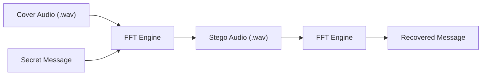
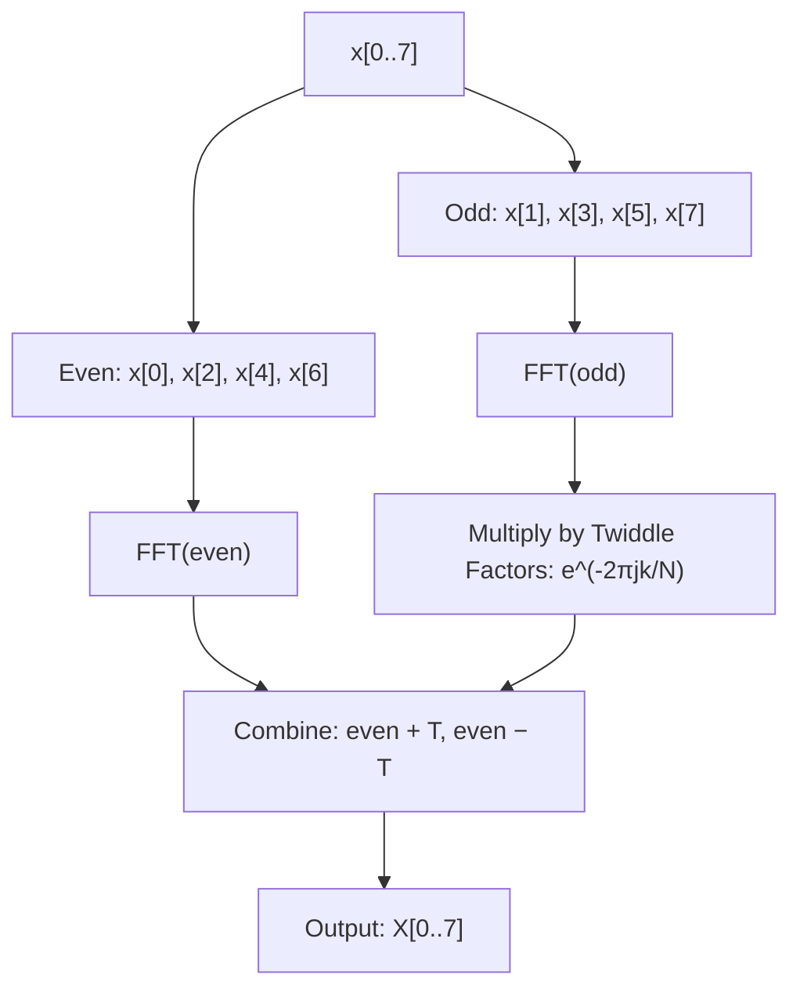
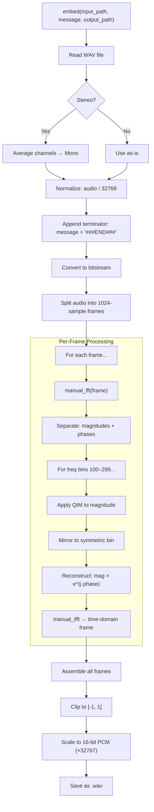
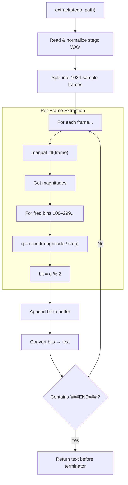
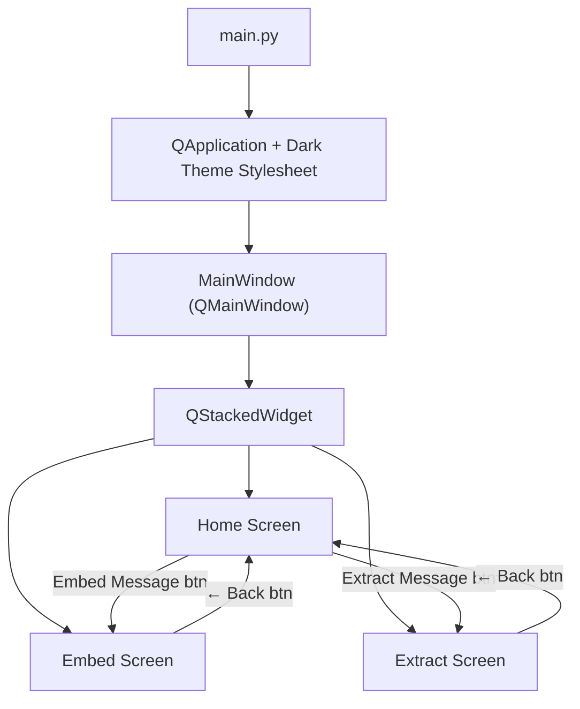

# Audio Steganography — Complete Project Walkthrough

This document explains how every part of the project works, from the mathematical foundations to the GUI, with annotated code walkthroughs and visual diagrams.

---

## Project Overview

This is a **desktop application** that hides secret text messages inside `.wav` audio files using **frequency-domain steganography**. The approach works in three stages:

1. **Transform** audio from the time domain into the frequency domain (FFT).
2. **Embed** bits into the frequency magnitudes using Quantization Index Modulation (QIM).
3. **Reconstruct** the audio back with Inverse FFT — the result sounds virtually identical to the original.



---

## File Structure

| File | Role | Lines |
|------|------|-------|
| `main.py` | Entry point — launches the PyQt5 GUI with a dark theme stylesheet | 94 |
| `gui.py` | Full GUI — home, embed, and extract screens with audio playback | 264 |
| `steganography.py` | Core engine — manual FFT, QIM embedding, and extraction | 196 |
| `generate_samples.py` | Utility — creates test `.wav` files (sine, noise, multi-tone) | 41 |
| `verify.py` | Integrity test — embeds then extracts and compares | 49 |

---

## 1. The Math: Manual FFT Implementation

The project implements the **Cooley-Tukey Radix-2 FFT** from scratch instead of using a library.

### 1.1 Recursive FFT (`_fft_recursive`)

```
Input:  x = [x₀, x₁, x₂, ..., xₙ₋₁]   (length MUST be a power of 2)
```

The algorithm splits the input into even-indexed and odd-indexed samples, recursively computes their FFTs, then combines them:



**How the code works (steganography.py lines 7-22):**

```python
def _fft_recursive(x):
    N = len(x)
    if N <= 1:               # Base case: single sample
        return x

    even = _fft_recursive(x[0::2])   # Recurse on even indices
    odd  = _fft_recursive(x[1::2])   # Recurse on odd indices

    # Twiddle factors: W_N^k = e^{-2πjk/N}
    T = np.exp(-2j * np.pi * np.arange(N // 2) / N) * odd

    return np.concatenate([even + T, even - T])
```

> **Why this works:** The Discrete Fourier Transform (DFT) of N points can be decomposed into two N/2-point DFTs. The twiddle factor `e^{-2πjk/N}` rotates the odd-indexed result before combining. This reduces complexity from O(N²) to O(N log N).

### 1.2 `manual_fft` — Zero-Padding Wrapper

Before calling the recursive FFT, the input is zero-padded to the **next power of 2**:

```python
def manual_fft(x):
    N = len(x)
    n_padded = 1
    while n_padded < N:
        n_padded <<= 1        # Find next power of 2

    x_padded = np.zeros(n_padded, dtype=complex)
    x_padded[:N] = x           # Copy original data, rest is zeros
    return _fft_recursive(x_padded)
```

> **Why zero-pad?** The Cooley-Tukey algorithm requires the input length to be a power of 2. Padding with zeros doesn't change the frequency content — it just increases the frequency resolution.

### 1.3 `manual_ifft` — Inverse FFT via Conjugation

The inverse FFT is computed using a clever identity:

```
IFFT(X) = conj( FFT( conj(X) ) ) / N
```

```python
def manual_ifft(X):
    N = len(X)
    n_padded = 1
    while n_padded < N:
        n_padded <<= 1

    X_padded = np.zeros(n_padded, dtype=complex)
    X_padded[:N] = X
    return np.conjugate(_fft_recursive(np.conjugate(X_padded))) / n_padded
```

> **Why this works:** Conjugating the input, applying FFT, then conjugating the output and dividing by N is mathematically equivalent to the IDFT. This avoids writing a separate inverse algorithm.

---

## 2. The Core Engine: `FFTSteganography` Class

### 2.1 Initialization

```python
class FFTSteganography:
    def __init__(self, frame_size=1024, freq_range=(100, 300), step=0.1):
        self.frame_size = frame_size     # Samples per FFT frame
        self.freq_range = freq_range     # Frequency bins 100–299 (200 bins)
        self.step = step                 # QIM quantization step size
        self.terminator = "###END###"    # End-of-message marker
```

| Parameter | Default | Purpose |
|-----------|---------|---------|
| `frame_size` | 1024 | Number of audio samples processed in each FFT frame |
| `freq_range` | (100, 300) | Which frequency bins to embed data into (200 bins per frame) |
| `step` | 0.1 | QIM quantization step — controls the trade-off between robustness and audio quality |
| `terminator` | `###END###` | Appended to the message so the extractor knows when to stop |

### 2.2 Text ↔ Bits Conversion

**Text to Bits:** Each character → 8-bit ASCII binary.

```python
def _text_to_bits(self, text):
    bits = []
    for char in text:
        bin_val = bin(ord(char))[2:].zfill(8)   # e.g., 'H' → '01001000'
        bits.extend([int(b) for b in bin_val])
    return bits
```

**Example:** `"Hi"` → `[0,1,0,0,1,0,0,0, 0,1,1,0,1,0,0,1]` (16 bits)

**Bits to Text:** Every 8 bits → one character.

```python
def _bits_to_text(self, bits):
    chars = []
    for i in range(0, len(bits), 8):
        byte = bits[i:i+8]
        if len(byte) < 8:
            break
        char_code = int("".join(map(str, byte)), 2)
        chars.append(chr(char_code))
    return "".join(chars)
```

---

## 3. Embedding Process (Hiding the Message)

This is the heart of the system. Here's the complete flow:



### 3.1 Audio Preprocessing

```python
sample_rate, data = wavfile.read(input_path)

# Stereo → Mono (average both channels)
if len(data.shape) > 1:
    audio = data.mean(axis=1).astype(np.float64)
else:
    audio = data.astype(np.float64)

# 16-bit PCM range [-32768, 32767] → float range [-1.0, 1.0]
if data.dtype == np.int16:
    audio /= 32768.0
```

### 3.2 QIM Embedding — The Key Algorithm

For each frequency bin in the target range, the magnitude is quantized so its **quantization index** encodes a bit:

```
q = floor(magnitude / step)

If bit == 1:  make q ODD   → magnitude = (q+1)·step if q is even, else q·step
If bit == 0:  make q EVEN  → magnitude = (q+1)·step if q is odd,  else q·step
```

```python
m = magnitudes[freq]
q = np.floor(m / self.step)

if bit == 1:
    if q % 2 == 0:
        magnitudes[freq] = (q + 1) * self.step   # Force odd
    else:
        magnitudes[freq] = q * self.step          # Already odd
else:
    if q % 2 == 1:
        magnitudes[freq] = (q + 1) * self.step   # Force even
    else:
        magnitudes[freq] = q * self.step          # Already even

# Maintain FFT symmetry for real-valued audio
magnitudes[self.frame_size - freq] = magnitudes[freq]
```

> **Why symmetry?** For a real-valued signal, the FFT output is symmetric: `X[k] = conj(X[N-k])`. If we modify `X[k]` but not `X[N-k]`, the IFFT produces complex numbers with imaginary artifacts. Mirroring the magnitude change preserves the real-valued property.

### 3.3 Capacity Calculation

Each frame provides **200 bits** of capacity (frequency bins 100 to 299). For a 5-second audio at 44100 Hz:

```
Total samples:  44100 × 5 = 220500
Total frames:   220500 / 1024 = 215 frames
Total capacity: 215 × 200 = 43000 bits = 5375 characters
```

---

## 4. Extraction Process (Recovering the Message)



**Key difference from embedding:** Extraction uses `round()` instead of `floor()`:

```python
m = magnitudes[freq]
q = np.round(m / self.step)     # Round to nearest integer
bits.append(int(q % 2))         # Even → 0, Odd → 1
```

> **Why `round` instead of `floor`?** During the conversion back to 16-bit PCM and saving, small rounding errors are introduced. Using `round()` is more tolerant of these minor perturbations — it snaps to the nearest quantization level rather than always going down.

---

## 5. The GUI (`gui.py` + `main.py`)

### 5.1 Architecture

The GUI uses **PyQt5** with a `QStackedWidget` for multi-screen navigation:



### 5.2 Screen Breakdown

| Screen | Widgets | Actions |
|--------|---------|---------|
| **Home** | Title label, description, two navigation buttons | Navigate to Embed or Extract |
| **Embed** | Back button, file loader, play button, text input, "Run Embedding" button | Load WAV → type message → save stego file |
| **Extract** | Back button, file loader, play button, read-only text display, "Run Extraction" button | Load stego WAV → view extracted message |

### 5.3 Audio Playback

The GUI includes a `QMediaPlayer` for playing/pausing loaded audio files:

```python
self.player = QMediaPlayer()

def toggle_play(self, path, btn):
    # If same file is loaded, toggle play/pause
    # Otherwise, load new file and play
    ...

def on_state_changed(self, state):
    if state == QMediaPlayer.PlayingState:
        self.active_play_btn.setText("⏸")     # Show pause icon
    else:
        self.active_play_btn.setText("▶")      # Show play icon
```

### 5.4 Dark Theme Styling (`main.py`)

The entire application is styled with a dark color scheme via a Qt stylesheet:

- **Background:** `#1a1a1a` (near-black)
- **Cards/Frames:** `#252525` with rounded corners
- **Buttons:** `#0078d7` (blue accent), green play button, gray back button
- **Text:** White with monospace font for text areas
- **Hover effects** on all interactive elements

---

## 6. Utility Scripts

### 6.1 `generate_samples.py` — Test Audio Generator

Creates three test `.wav` files in the `samples/` directory:

| Generator | Output | Description |
|-----------|--------|-------------|
| `generate_tone()` | `sine_440hz.wav` | Pure 440 Hz sine wave (concert A), 5 seconds |
| `generate_noise()` | `white_noise.wav` | Random uniform noise, 5 seconds |
| `generate_multi_tone()` | `complex_tone.wav` | Mix of 220 Hz + 440 Hz + 880 Hz, 5 seconds |

All outputs are 16-bit PCM at 44100 Hz sample rate.

### 6.2 `verify.py` — Automated Integrity Test

Runs a full round-trip test:

```
1. Create a sample audio file (440 Hz + 880 Hz mix)
2. Embed test message: "Top Secret Message: FFT Steganography is cool!"
3. Extract message from the stego file
4. Compare extracted vs. original → SUCCESS / FAILURE
5. Clean up temporary files
```

---

## 7. End-to-End Example

Here is a concrete walkthrough of embedding the message `"Hello"` into audio:

### Step 1 — Prepare the message
```
"Hello" + "###END###" = "Hello###END###"
→ Bits: [01001000 01100101 01101100 01101100 01101111 00100011 ...]
→ Total: 14 characters × 8 bits = 112 bits needed
```

### Step 2 — Read and frame the audio
```
44100 Hz × 5 sec = 220,500 samples
Frame size = 1024  →  215 frames
Only 1 frame needed (200 bits available > 112 bits needed)
```

### Step 3 — FFT on Frame 0
```
frame = audio[0:1024]           # 1024 time-domain samples
F = manual_fft(frame)           # → 1024 complex frequency-domain values
magnitudes = |F|                # Energy at each frequency
phases = angle(F)               # Phase at each frequency
```

### Step 4 — QIM embedding (first few bins)
```
Freq bin 100:  magnitude = 0.45, step = 0.1
               q = floor(0.45/0.1) = 4 (even)
               Bit to embed: 0 (H = 01001000, first bit is 0)
               q is already even → no change needed
               magnitude stays 0.40

Freq bin 101:  magnitude = 0.32, step = 0.1
               q = floor(0.32/0.1) = 3 (odd)
               Bit to embed: 1
               q is already odd → magnitude = 3 × 0.1 = 0.30
```

### Step 5 — Reconstruct and save
```
F_new = magnitudes × e^(j × phases)    # Modified spectrum
frame_new = real(manual_ifft(F_new))    # Back to time domain
→ Clip to [-1, 1]
→ Multiply by 32767 → int16
→ Save as WAV
```

### Step 6 — Extraction
```
Read stego WAV → frame[0:1024] → FFT → magnitudes
Freq bin 100:  magnitude ≈ 0.40, q = round(0.40/0.1) = 4 (even) → bit 0 ✓
Freq bin 101:  magnitude ≈ 0.30, q = round(0.30/0.1) = 3 (odd)  → bit 1 ✓
... continue until "###END###" found ...
→ Output: "Hello"
```

---

## 8. Dependencies

| Package | Version | Purpose |
|---------|---------|---------|
| `numpy` | any | Array operations, complex arithmetic |
| `scipy` | any | WAV file reading/writing (`scipy.io.wavfile`) |
| `PyQt5` | any | Desktop GUI framework |

> **Note:** `scipy.fft` is **not** used — the FFT is implemented manually with the Cooley-Tukey algorithm.

---

## 9. Limitations and Trade-offs

| Aspect | Detail |
|--------|--------|
| **Format** | Only supports `.wav` (uncompressed PCM). Lossy formats like MP3 would destroy the embedded data. |
| **Capacity** | ~200 bits per frame. For longer messages, the audio must be long enough. |
| **Robustness** | Survives WAV re-saving, but not re-encoding (compression), filtering, or resampling. |
| **Audibility** | Mid-frequency range (bins 100–300) minimizes perceptibility, but the step size controls the trade-off. |
| **Security** | No encryption — the message is embedded in plaintext bits. Anyone with the same parameters can extract it. |
