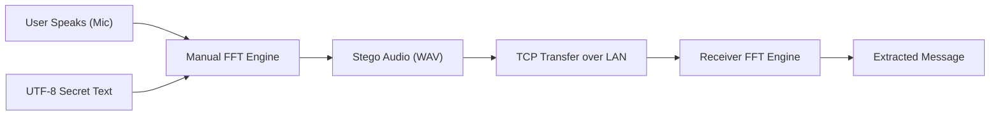
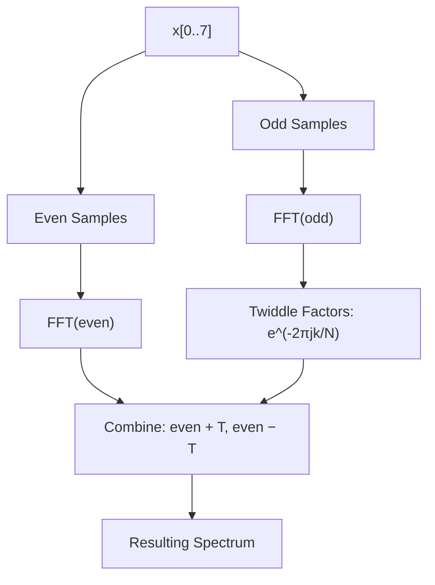

# Audio Steganography — Complete Project Walkthrough

This document explains how every part of the project works, from the mathematical foundations to the responsive GUI and P2P networking, with annotated code walkthroughs and visual diagrams.

---

## Project Overview

This is a **desktop communication platform** that hides secret text messages inside audio signals and transmits them over a local network. The approach works in three stages:

1. **Capture**: Record audio via microphone with a manual start/stop model.
2. **Transform & Embed**: Use a **Manual Recursive FFT** to hide UTF-8 encoded bits into frequency magnitudes (QIM).
3. **Transmit**: Send the "stego" audio to another device over Wi-Fi using a direct TCP connection.



---

## File Structure

| File | Role | Lines |
|------|------|-------|
| `main.py` | Entry point — launches the app with dynamic font scaling | ~25 |
| `gui.py` | Full 4-screen GUI — manages state and thread-safe signals | ~1040 |
| `steganography.py` | Core engine — manual FFT/IFFT, QIM, and UTF-8 logic | ~300 |
| `network.py` | P2P Networking — TCP server and sender for LAN transfer | ~170 |
| `recorder.py` | Audio Capture — asynchronous microphone recording | ~100 |

---

## 1. The Math: Manual FFT Implementation

The project implements the **Cooley-Tukey Radix-2 FFT** from scratch to avoid dependency on pre-compiled libraries for the core math.

### 1.1 Recursive FFT (`_fft_recursive`)

The algorithm uses a "Decimation-In-Time" approach, splitting the signal into even and odd indices until it reaches a single sample.



**Key Code (`steganography.py`):**
```python
def _fft_recursive(x):
    N = len(x)
    if N <= 1: return x
    even = _fft_recursive(x[0::2])
    odd  = _fft_recursive(x[1::2])
    T = np.exp(-2j * np.pi * np.arange(N // 2) / N) * odd
    return np.concatenate([even + T, even - T])
```

---

## 2. The Steganography Engine: `FFTSteganography`

### 2.1 UTF-8 Bit Conversion
Unlike standard ASCII, we use **UTF-8** to support special characters and emojis.

```python
def _text_to_bits(self, text):
    bits = []
    for byte in text.encode('utf-8'):
        bin_val = bin(byte)[2:].zfill(8)
        bits.extend([int(b) for b in bin_val])
    return bits
```

### 2.2 Quantization Index Modulation (QIM)
We hide bits by forcing the magnitude of frequency bins (100–300Hz) to specific quantization levels.
- **Bit 0**: Magnitude is rounded to an **Even** multiple of the step (0.1).
- **Bit 1**: Magnitude is rounded to an **Odd** multiple of the step.

---

## 3. Communication Workflow

### 3.1 Capturing Audio (`recorder.py`)
Instead of a fixed duration, we use a `Manual Stop` model. The `AsyncRecorder` captures audio in a background thread until the user clicks "Stop."

### 3.2 Embedding & Sending (`gui.py` + `network.py`)
1. The GUI calls `steganography.embed_array`.
2. The manual FFT transforms the recorded audio.
3. Bits are hidden in the magnitudes.
4. Manual IFFT reconstructs the WAV file.
5. `network.send_audio` transmits the file over TCP.

---

## 4. The Responsive GUI Architecture

The GUI uses a **4-Screen Stacked Architecture**:

1. **Home Screen**: Main entry and branding.
2. **Send Screen**: Mic recording, text input, and transmission status.
3. **Receive Screen**: Automatic listening and message extraction log.
4. **Settings Screen**: Port and IP configuration.

### 4.1 Thread Safety
Since extraction and networking are heavy operations, they run in background threads. We use a **Signal Bridge** to safely update the UI:

```python
class Bridge(QObject):
    extract_done = pyqtSignal(str) # Passes text from background to UI
```

### 4.2 Dynamic Styling (`main.py`)
To support full-screen mode, the UI recalculates font sizes dynamically using a scale factor:
```python
def get_style(width, height):
    scale = min(width / 900.0, height / 700.0)
    # ... calculates fonts like int(14 * scale) ...
```

---

## 5. End-to-End Example (Walkthrough)

### Step 1 — Sender Side
- User clicks **"Record Mic"** and speaks.
- User types: `"Secret Message 🔒"`.
- User clicks **"Embed & Send"**.
- The app converts the emoji to UTF-8 bits, performs the manual FFT, modifies magnitudes, and pushes the WAV bytes to the receiver's IP.

### Step 2 — Receiver Side
- The `ReceiverServer` (running in the background) detects the incoming connection.
- The WAV bytes are saved and played.
- The extraction worker runs the manual FFT, reads the frequency magnitudes, and detects the `###END###` terminator.
- The UI pops up: `"Message Extracted: Secret Message 🔒"`.

---

## 6. Technical Specifications

- **Sample Rate**: 44100 Hz.
- **Frame Size**: 1024 samples (required for radix-2 FFT).
- **Network Port**: 9999 (TCP).
- **Frequency Bins**: 100 to 300 (roughly 4k bits/second capacity).
- **Encoding**: UTF-8 (Full Unicode support).
- **Platform**: Cross-platform Python (PyQt5, NumPy, SoundDevice).
